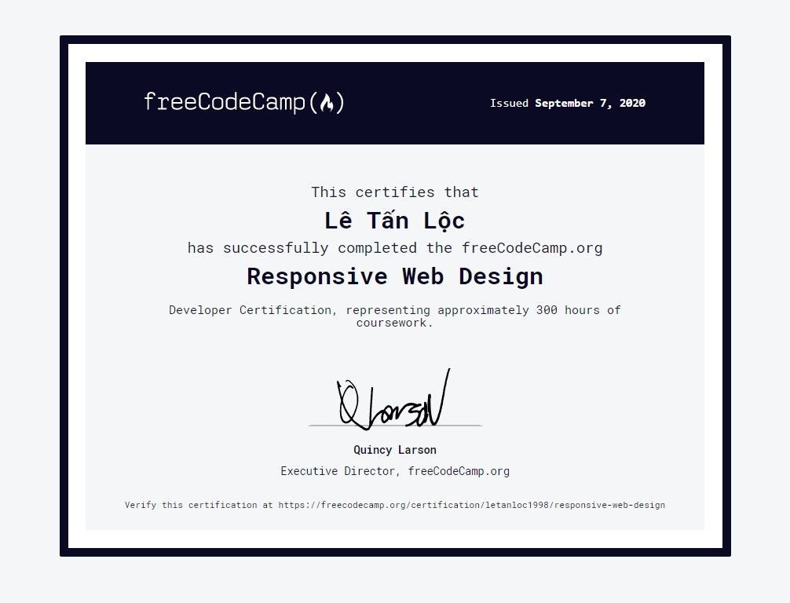
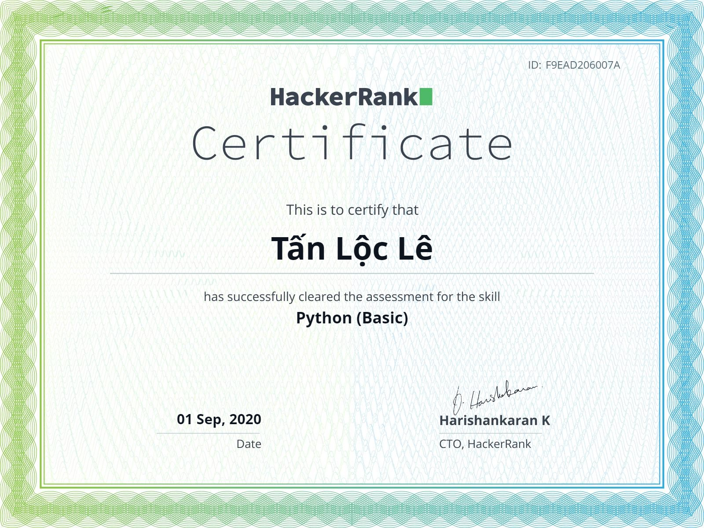
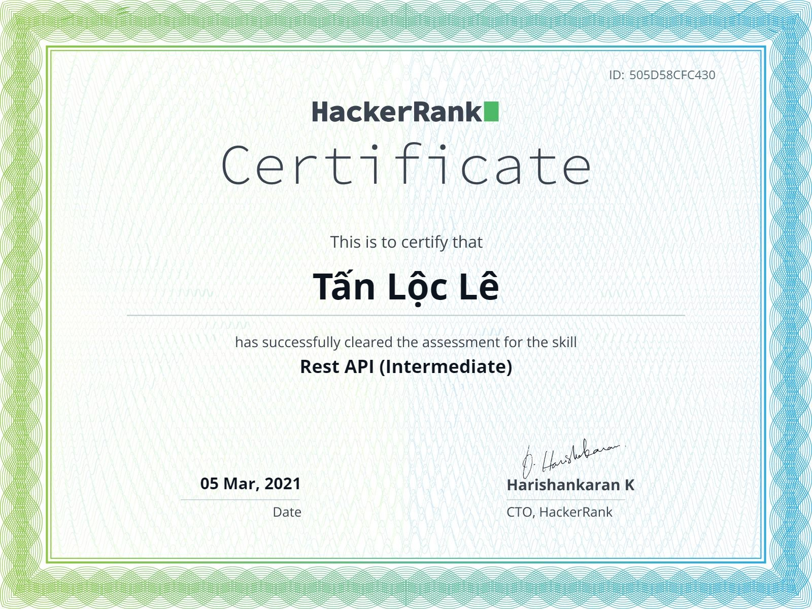
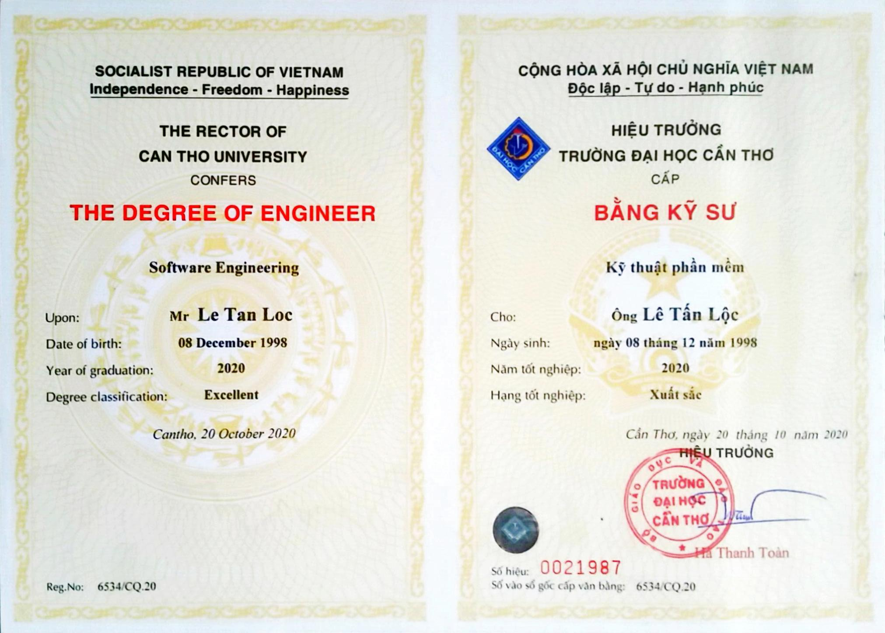
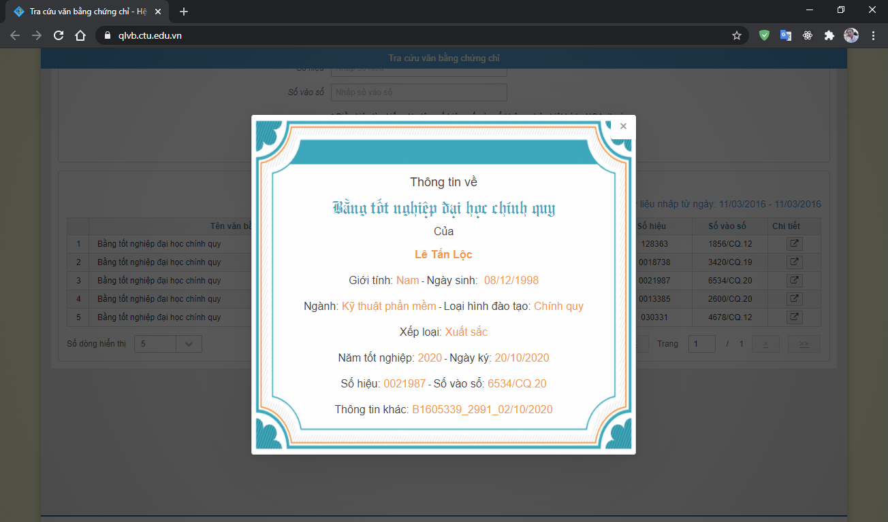

# **[Tan-Loc Le](https://github.com/letanloc1998/)**

## Java Developer at [UNIT Corp](https://unit.com.vn/)

<!-- prettier-ignore -->
| [Tan-Loc Le](https://github.com/letanloc1998/) | |
| :- | :- |
|  |  |
| **Contact** *Liên hệ* | |
|  | Ho Chi Minh, Viet Nam *Hồ Chí Minh, Việt Nam* |
|  | +8432723332 |
|  | letanloc1998@gmail.com |
|   |   |
| **Personal Information** *Thông tin cá nhân* | |
| Name *Tên* | Le Tan Loc *Lê Tấn Lộc* |
| Nationality *Quốc tịch* | Vietnamese *Việt Nam* |
| Date of birth *Ngày sinh* | Dec 8th, 1998 *8/12/1998* |
| Gender *Giới tính* | Male *Nam* |
|   |   |
| **Education** *Giáo dục* | |
| Aug 2016 - Sep 2020 *8/2016 - 9/2020*  | - [Can Tho University](https://www.ctu.edu.vn/) - _Software Engineering_ [*Đại học Cần Thơ*](https://www.ctu.edu.vn/) - *Kỹ thuật phần mềm*  - GPA: `3.71/4.00` *Điểm trung bình tích lũy*: `3.71/4.00` |
| Aug 2018 - Sep 2018   *8/2018 - 9/2018* | [Can Tho University Software Center (CUSC)](https://www.cusc.ctu.edu.vn/)   _Android application development (module 1)_  *[Trung tâm công nghệ phần mềm đại học Cần Thơ](https://www.cusc.ctu.edu.vn/)*   *Phát triển ứng dụng di động trên nền Android - Lập trình ứng dụng cho Android* |
|   |   |
| **Honors & Awards** *Thành tích và giải thưởng* | |
| Can Tho University *Đại học Cần Thơ* | - *Scholarship* - every semester from Aug 2016 to May 2020 *Học bổng mỗi học kì từ 8/2016 đến 5/2020*  - *`First in class`* - merit certificate (2016-2017, 2018-2019) *Khen thưởng nhất lớp năm học 2016-2017, 2018-2019*  - *Valedictorian of major* - for course 2016-2020 *Thủ khoa ngành khóa 2016-2017* |
| Other *Khác* | - Provincial excellent student of calculator (6th), chemistry (3th) at secondary school *Xếp hạng 6 học sinh giỏi cấp tỉnh máy tính cầm tay (19.75/20 điểm), xếp hạng 3 học sinh giỏi hóa cấp tỉnh (14.5/20 điểm) cấp trung học cơ sở*  - Excellent level of school primary school, secondary school *Học sinh xuất sắc toàn trường cấp tiểu học, trung học cơ sở*  ... |
|  |   |
| **Experience** *Kinh nghiệm* | |
| | |
| **`Overview`** *Tổng quan* | |
| May 2019 - Oct 2019 *5/2019 - 10/2019* | [AppCore](http://appcore.com.vn/) - Python (Django, Django REST framework) |
| Mar 2020 - Apr 2020 *3/2020 - 4/2020* | [VNPT IT](https://vnptit.vn/) - Spring Boot (JHipster) |
| Jul 2020 - now *7/2020 - hiện tại* | [UNIT Corp](https://unit.com.vn/) - Spring MVC, Spring Boot |
| | |
| **`Projects`** *Dự án* | *Click for more information* |
| [AppCore](http://appcore.com.vn/) - Chatbot | 
 
Chatbot, data analytic & suggestion
<table><thead><th>#</th><th></th></tr></thead><tbody><tr><td><strong>Duration</strong></td><td>1 month</td></tr><tr><td><strong>Team size</strong></td><td>3</td></tr><tr><td><strong>Position(s)</strong></td><td>Research & Development</td></tr><tr><td><strong>Description</strong></td><td>Chat bot with suggestion feature use data and machine learning</td></tr><tr><td><strong>Reponsibilities</strong></td><td>- Research:  + Rasa framework,  + library(sklearn, Sutime, Ducking, pandas,...),  + Redis database - Develop:  + chatbot,  + data processing,  + suggestion use machine learning</td></tr><tr><td><strong>Tech</strong></td><td>- Python, Rasa framwork, sklearn, Sutime, Ducking, pandas, Redis... - Machine learning (sklearn - cluster,...) - Data processing (pandas,...)</td></tr><tr><td><strong>Tools</strong></td><td>Pycharm, VSCode,...</td></tr></tbody></table>
 |
| [AppCore](http://appcore.com.vn/) - Web Application Firewall | 
 
Detect and classify attack
<table><thead><th>#</th><th></th></tr></thead><tbody><tr><td><strong>Duration</strong></td><td>1 week</td></tr><tr><td><strong>Team size</strong></td><td>3</td></tr><tr><td><strong>Position(s)</strong></td><td>Research & Development</td></tr><tr><td><strong>Description</strong></td><td>Detect and classify attack (SQL injection, XSS,...) from request</td></tr><tr><td><strong>Reponsibilities</strong></td><td>Research: type of attack, sklearn, machine learning,... Develop: raw data and training model</td></tr><tr><td><strong>Tech</strong></td><td>Machine learning</td></tr><tr><td><strong>Tools</strong></td><td>Pycharm, VSCode,...</td></tr></tbody></table>
 |
| [AppCore](http://appcore.com.vn/) - *Other* | 
 
Web (Python, Django, DRF, API, 3rd party,...)
<table><thead><th>#</th><th></th></tr></thead><tbody><tr><td><strong>Duration</strong></td><td>1 month</td></tr><tr><td><strong>Team size</strong></td><td>1</td></tr><tr><td><strong>Position(s)</strong></td><td>Research & Development</td></tr><tr><td><strong>Description</strong></td><td>- Demo API for ecommerce - Connect 3rd party online payment, - Send message and send mail,...</td></tr><tr><td><strong>Reponsibilities</strong></td><td>- Research:  + Python, Django (MVT), Django REST framework - <i>API</i>,  + Stripe - <i>online payment, webhook transaction,...</i>,  + Firebase cloud message/Pubnub - <i>Send message</i>, Sengrid - <i>send mail</i></td></tr><tr><td><strong>Tech</strong></td><td>Python, Django, DRF, 3rd party, API, online payment,...</td></tr><tr><td><strong>Tools</strong></td><td>Pycharm, VSCode,...</td></tr></tbody></table>
 |
| [AppCore](http://appcore.com.vn/) - *Other* | 
 
Image processing, machine learning,...
<table><thead><th>#</th><th></th></tr></thead><tbody><tr><td><strong>Duration</strong></td><td>1 month</td></tr><tr><td><strong>Team size</strong></td><td>1</td></tr><tr><td><strong>Position(s)</strong></td><td>Research & Development</td></tr><tr><td><strong>Description</strong></td><td>Zip image, detect object in image (slippers,...), machine learning,...</td></tr><tr><td><strong>Reponsibilities</strong></td><td>Research & Development</td></tr><tr><td><strong>Tech</strong></td><td>Python, OpenCV, machine learning, train model (yolo, rcnn,...)</td></tr><tr><td><strong>Tools</strong></td><td>Pycharm, VSCode,...</td></tr></tbody></table>
 |
| [VNPT IT](https://vnptit.vn/) - Family Medicine | 
 
Manage patients, medical examination
<table><thead><th>#</th><th></th></tr></thead><tbody><tr><td><strong>Duration</strong></td><td>2 months</td></tr><tr><td><strong>Team size</strong></td><td>4</td></tr><tr><td><strong>Position(s)</strong></td><td>Research & Development >_<</td></tr><tr><td><strong>Description</strong></td><td>Build backend microservice api</td></tr><tr><td><strong>Reponsibilities</strong></td><td>Research microservice (JHipster,..), authentication (SSO), ... Development: (1) api service Document</td></tr><tr><td><strong>Tech</strong></td><td>- Java, Spring Boot, Hibernate, - JHipster, UAA, OAuth2, Consul, Keycloak, Okta, Hazelcast...</td></tr><tr><td><strong>Tools</strong></td><td>IntellIJ, VSCode,...</td></tr></tbody></table>
 |
| [UNIT Corp](https://unit.com.vn/) - *Private Project* | 
 
`eP2P` - Purchase to Payment - Quản lý thông tin mua hàng, thanh toán và ngân sách - Manage asset, purchase, payment,...
<table><thead><th>#</th><th></th></tr></thead><tbody><tr><td><strong>Duration</strong></td><td>from Sep 2020 to now</td></tr><tr><td><strong>Team size</strong></td><td>~5</td></tr><tr><td><strong>Position(s)</strong></td><td>Development</td></tr><tr><td><strong>Description</strong></td><td>Java Spring MVC web app</td></tr><tr><td><strong>Reponsibilities</strong></td><td>Fix bugs, develop new feature</td></tr><tr><td><strong>Tech</strong></td><td>- Java, Java Spring MVC, Thymeleaf, SQL server,... - HTML, CSS, JS, Bootstrap, JQuery</td></tr><tr><td><strong>Tools</strong></td><td>Eclipse, VSCode, IntellIJ, Pycharm, TortoiseSVN,...</td></tr></tbody></table>
 |
| [UNIT Corp](https://unit.com.vn/) - *Private Project* | 
 
`DMS` - Insurance enterprise solution
<table><thead><th>#</th><th></th></tr></thead><tbody><tr><td><strong>Duration</strong></td><td>from Oct 2020 to now</td></tr><tr><td><strong>Team size</strong></td><td>~25</td></tr><tr><td><strong>Position(s)</strong></td><td>Development</td></tr><tr><td><strong>Description</strong></td><td>Java Spring MVC web app</td></tr><tr><td><strong>Reponsibilities</strong></td><td>Fix bugs, develop new feature</td></tr><tr><td><strong>Tech</strong></td><td>- Java, Java Spring MVC, Thymeleaf, SQL server,... - HTML, CSS, JS, Bootstrap, JQuery</td></tr><tr><td><strong>Tools</strong></td><td>Eclipse, VSCode, IntellIJ, Pycharm, TortoiseSVN,...</td></tr></tbody></table>
 |
| [UNIT Corp](https://unit.com.vn/) - *Private Project* | 
 
`eRecruitment`- Manage workflow process recruitment candidate/applicant
<table><thead><th>#</th><th></th></tr></thead><tbody><tr><td><strong>Duration</strong></td><td>research from Jan to now </td></tr><tr><td><strong>Team size</strong></td><td></td></tr><tr><td><strong>Position(s)</strong></td><td>Research & Development</td></tr><tr><td><strong>Description</strong></td><td>Java Spring Boot web app (BE), React (FE)</td></tr><tr><td><strong>Reponsibilities</strong></td><td>Research & Development ReactJS, Java web app</td></tr><tr><td><strong>Tech</strong></td><td>React, Java Spring Boot,...</td></tr><tr><td><strong>Tools</strong></td><td>VSCode, Eclipse</td></tr></tbody></table>
 |
| | |
| **`Other`** | |
| Angular | 
 
Can Tho University - Software Development Project
<table><thead><th>#</th><th></th></tr></thead><tbody><tr><td><strong>Duration</strong></td><td>~4 months (from Aug 2020 to Dec 2020)</td></tr><tr><td><strong>Team size</strong></td><td>4</td></tr><tr><td><strong>Position(s)</strong></td><td>Management, Development</td></tr><tr><td><strong>Description</strong></td><td>Ecommerce project</td></tr><tr><td><strong>Reponsibilities</strong></td><td>- Management - Develop FE use Angular 8 - Document - Deploy (Azure, Github Page) Fix bug BE (Django/Django RestFramework)</td></tr><tr><td><strong>Tech</strong></td><td>- Angular (8), Django/Django RestFramework, MySQL, Azure - HTML, CSS, JS, Bootstrap, JQuery</td></tr><tr><td><strong>Tools</strong></td><td>VSCode, Pycharm,...</td></tr></tbody></table>
 |
| Android | 
 
Can Tho University - Thesis of Software Engineering
<table><thead><th>#</th><th></th></tr></thead><tbody><tr><td><strong>Duration</strong></td><td>~4 months (from Jan 2020 to May 2020)</td></tr><tr><td><strong>Team size</strong></td><td>1</td></tr><tr><td><strong>Position(s)</strong></td><td>Development</td></tr><tr><td><strong>Description</strong></td><td>Wildlife Conservation for [Tràm Chim National Park](https://en.wikipedia.org/wiki/Tr%C3%A0m_Chim_National_Park)</td></tr><tr><td><strong>Reponsibilities</strong></td><td>- Develop Android app - Document - Fix SQL injection old website</td></tr><tr><td><strong>Tech</strong></td><td>- Android (Java) and library (...) - Google Colab</td></tr><tr><td><strong>Tools</strong></td><td>Android Studio, VSCode,...</td></tr></tbody></table>
 |
| PHP | - Can Tho University - Thesis of Software Engineering - Backend API - Can Tho University - Software Constructions Project - Can Tho University - Web Programming Project |
| ReactJS | - UNIT Corp - eRecruitment  |
| ... | Flask, FaskAPI, Java Swing, .NET (ADO.NET, ASP.NET), MySQL, PL/SQL Oracle |
|   |   |
| **Certificate** *Chứng chỉ* | |
| [Freecodecamp](https://www.freecodecamp.org/) | 

[Responsive web design](https://www.freecodecamp.org/certification/letanloc1998/responsive-web-design)
 
 |
| [Hackerrank](https://www.hackerrank.com/letanloc1998) | 

[Python (Basic) Certificate](https://www.hackerrank.com/certificates/f9ead206007a)
 
 |
| [Hackerrank](https://www.hackerrank.com/letanloc1998) | 

[JavaScript (Basic) Certificate](https://www.hackerrank.com/certificates/07d6b2e3311e)
 
 |
| [Hackerrank](https://www.hackerrank.com/letanloc1998) | 

[Rest API (Intermediate) Certificate](https://www.hackerrank.com/certificates/505d58cfc430)
 
 |
|   |   |
| **...** | |
| [Can Tho University](https://www.ctu.edu.vn/) | 

Degree

[Check Diploma Status](https://qlvb.ctu.edu.vn/)

 |

| Public repository status | |
| :-: | :-: |
|||
|  |  |
|||
